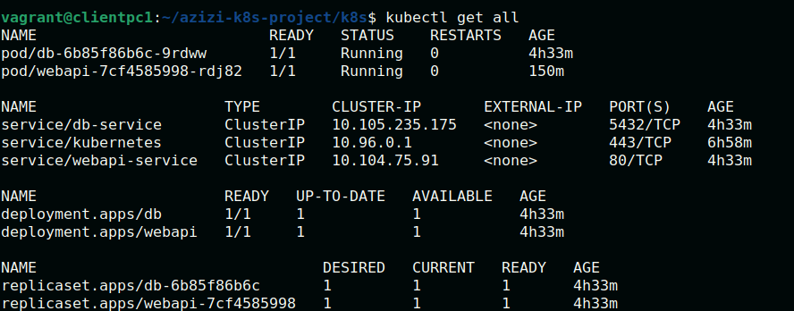
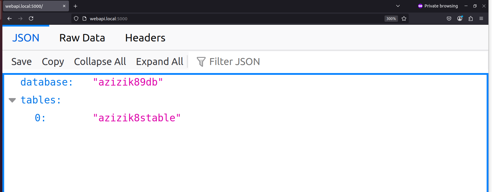

## Project Goal: Kubernetes, PostgreSQL and WebAPI: kubeadm, kubelet, k9s
I this project we will install and run Kubernetes using Kubeadm, kubelet and kubecetl.
We will run both master and worker node in same machine! (Ubuntu 22.04)
Then will create our two pods:
* One pod will run PostgreSQL
* Another pod will run our webAPI APP connecting to database to retrieve Database and its Tables

## Setup Kubernetes: 
Running both the Kubernetes master (control plane) and worker node on the same Ubuntu machine is great for testing and learning! 

* [Kubeadm](https://kubernetes.io/docs/setup/production-environment/tools/kubeadm/install-kubeadm/) is the recommended tool for bootstrapping Kubernetes clusters. 
* We need at least:
  * 2 CPUs and 2GB RAM (4GB+ recommended)
  * Docker or another container runtime installed (we’ll use containerd here)

### Installation (Single Node with Master + Worker)
#### Disable Swap
```
sudo swapoff -a
sudo sed -i '/ swap / s/^/#/' /etc/fstab
```
#### Install Container Runtime (containerd)
```
sudo apt update && sudo apt install -y containerd
sudo mkdir -p /etc/containerd
containerd config default | sudo tee /etc/containerd/config.toml
sudo systemctl restart containerd
sudo systemctl enable containerd
```
#### Load Kernel Modules & sysctl settings
```
cat <<EOF | sudo tee /etc/modules-load.d/k8s.conf
overlay
br_netfilter
EOF

sudo modprobe overlay
sudo modprobe br_netfilter

cat <<EOF | sudo tee /etc/sysctl.d/k8s.conf
net.bridge.bridge-nf-call-ip6tables = 1
net.bridge.bridge-nf-call-iptables = 1
net.ipv4.ip_forward = 1
EOF

sudo sysctl --system
```

#### Install kubeadm, kubelet, kubectl
Note: Based of Kubernetes formal website, these instructions are for Kubernetes v1.32.

```
sudo apt-get update
sudo apt-get install -y apt-transport-https ca-certificates curl gpg
```
Download the public signing key:
```
sudo mkdir -p -m 755 /etc/apt/keyrings
curl -fsSL https://pkgs.k8s.io/core:/stable:/v1.32/deb/Release.key | sudo gpg --dearmor -o /etc/apt/keyrings/kubernetes-apt-keyring.gpg
``` 
Add the appropriate Kubernetes apt repository:
```
echo 'deb [signed-by=/etc/apt/keyrings/kubernetes-apt-keyring.gpg] https://pkgs.k8s.io/core:/stable:/v1.32/deb/ /' | sudo tee /etc/apt/sources.list.d/kubernetes.list
```
#### Finally install:
```
sudo apt-get update
sudo apt-get install -y kubelet kubeadm kubectl
sudo apt-mark hold kubelet kubeadm kubectl
```
Note: If problem with kubectl installation, then try [kubectl](https://kubernetes.io/docs/tasks/tools/install-kubectl-linux/) to install. 
You may need to Set Up Kubectl for your User:
```
mkdir -p $HOME/.kube
sudo cp -i /etc/kubernetes/admin.conf $HOME/.kube/config
sudo chown $(id -u):$(id -g) $HOME/.kube/config
```
##### Initialize the control plane (on master node)
```
sudo kubeadm init --pod-network-cidr=192.168.0.0/16
```
#### Install a CNI plugin
```
kubectl apply -f https://raw.githubusercontent.com/projectcalico/calico/v3.27.0/manifests/calico.yaml
```
#### If you run both Master and Workder run in same machine then run:
```
kubectl taint nodes $(hostname) node-role.kubernetes.io/control-plane-
```
#### If your Worker is running in a separate machine, join it to master:
Run this command on each worker node after setting up kubeadm, kubelet, and disabling swap.
```
kubeadm join <master-ip>:6443 --token <token> --discovery-token-ca-cert-hash sha256:<hash>
```
You can regenerate it on master node:
```
kubeadm token create --print-join-command
```
For example: 
```
azizi-k8s-project$ kubeadm token create --print-join-command
kubeadm join 192.168.178.38:6443 --token gxg4bj.afeo9sx9fokjcf1o --discovery-token-ca-cert-hash sha256:4859fcdf0378f2b960646a610736a3197b975be8fc5a885817dff29ad1fd2586
```

### Install K9S:
K9S is a greate kubenetes management tool which can follow [k9s](https://dev.to/dm8ry/how-to-install-k9s-on-ubuntu-a-step-by-step-guide-2f98) to install it. 

## Create and run Pods!
We will go ahead with following structure:
```
azizi-k8s-project$ tree
.
├── db-init/
│   └── init.sql                                 # SQL script to initialize the database and create table
│
├── webapi/
│   ├── app.py                                   # Flask app to connect and query the database
│   └── Dockerfile                               # Dockerfile to containerize the Flask app
│
├── k8s/
│   ├── secret.yaml                              # Secret for PostgreSQL username and password
│   ├── db-init-config.yaml                      # ConfigMap with init.sql content to bootstrap the database
│   ├── db-deployment-service.yaml               # Combined Deployment and Service for the PostgreSQL database
│   ├── webapi-deployment-service.yaml           # Combined Deployment and Service for the Web API
│   └── ingress.yaml                             # Ingress to expose the Web API via HTTP
```
**Here are files:**
* db-deployment-service.yaml [here](k8s/db-deployment-service.yaml)
* webapi-deployment-service.yaml [here](k8s/webapi-deployment-service.yaml)
* secret.yaml [here](secret.yaml)
* db-init-config.yaml [here](k8s/db-init-config.yaml)
* ingress.yaml [here](k8s/ingress.yaml)
* app.py [here](webapi/app.py)
* Dockerfile [here](webapi/Dockerfile)
* init.sql [here](db-init/init.sql)

## Build and Push Webapi Docker image
```
docker build -t azizivakili/k8swebapi:latest .
```
login to the docker hub to push the built image: 
```
docker login
```
Push to Docker Hub:
```
docker push  azizivakili/k8swebapi:latest
```

## Apply and deploy
```
kubectl apply -f k8s/secret.yaml
kubectl apply -f k8s/db-init-config.yaml
kubectl apply -f k8s/db-deployment-service.yaml
kubectl apply -f k8s/weapi-deployment-service.yaml
kubectl apply -f k8s/ingress.yaml
 ```
Check if deployments and pods are running:


By using ingress local, We can access our web app now from:
```
http://webapi.local
```
or can use protforwaring:
```
kubectl port-forward service/webapi-service 5000:80
```
We can also set the portforwaring via K9S (press Shift+F  in k9s!)

## Finally, webapp!


**Congratulations!**


